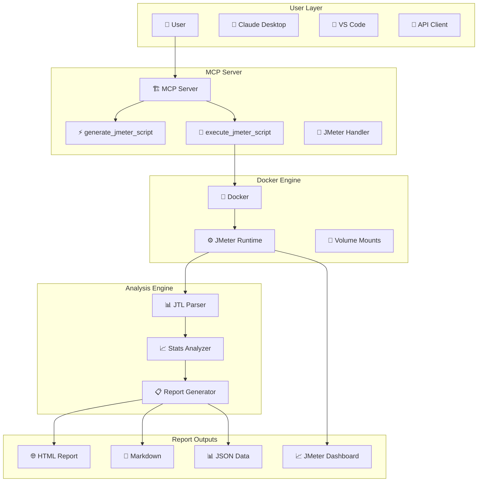

# 🎯 JMeter MCP Server

A powerful Model Context Protocol (MCP) server for automated JMeter test generation and execution with Docker integration and comprehensive performance analysis.

[](https://github.com/chandanvars/jmeter-mcp-server/stargazers)
[](https://github.com/chandanvars/jmeter-mcp-server/network/members)
[](https://github.com/chandanvars/jmeter-mcp-server/issues)
[](https://opensource.org/licenses/MIT)

## 🌟 Overview

The JMeter MCP Server is a streamlined, production-ready testing solution that integrates with MCP-compatible clients (like Claude Desktop, VS Code) to generate sophisticated JMeter test plans and execute them automatically via Docker with comprehensive performance analysis.

**🚀 Key Features:**
- **2 Essential Tools**: Streamlined for maximum efficiency
- **Complete Docker Automation**: Zero manual intervention required  
- **Multi-Format Reports**: HTML, Markdown, and JSON outputs
- **Interactive Visualizations**: Chart.js powered performance charts
- **Professional Analysis**: Trend detection and bottleneck identification
- **API & UI Testing**: Support for both API and web interface testing
- **Real-time Execution**: Containerized JMeter with live results

## 🛠️ Core Tools

### 1. 🚀 **generate_jmeter_script** - Advanced Test Generation
Create comprehensive JMeter test plans with modern features:

**Features:**
- Multi-threaded load simulation with configurable patterns
- CSV data parameterization for data-driven testing  
- Response correlation and extraction (JSON Path, Regex)
- Multiple timer types and realistic load patterns
- Custom headers, authentication, and session management
- Response assertions and comprehensive validations
- Automatic file generation to `output/` directory

**Example:**
```json
{
  "testName": "API Performance Test",
  "baseUrl": "https://api.example.com",
  "threadGroup": { 
    "numThreads": 50, 
    "rampUpTime": 120, 
    "loops": 10 
  },
  "requests": [
    {
      "name": "Login",
      "method": "POST", 
      "path": "/auth/login",
      "headers": { "Content-Type": "application/json" },
      "body": "{\"username\":\"${username}\",\"password\":\"${password}\"}",
      "extractors": [
        {
          "variableName": "authToken", 
          "jsonPath": "$.token"
        }
      ],
      "assertions": [
        {
          "type": "responseCode",
          "value": "200"
        }
      ]
    }
  ],
  "csvDataSet": {
    "fileName": "users.csv", 
    "variableNames": "username,password",
    "delimiter": ","
  }
}
```

### 2. 🐳 **execute_jmeter_script** - Docker Execution Engine
Automatically execute JMeter tests in a containerized environment with comprehensive analysis:

**Features:**
- **Docker Automation**: Uses `justb4/jmeter:latest` for consistent execution
- **Volume Mounting**: Seamless data exchange between host and container
- **Resource Management**: Configurable CPU and memory limits
- **Performance Analysis**: Multi-dimensional performance metrics
- **HTML Reports**: Interactive dashboards with Chart.js visualizations
- **Trend Analysis**: Automatic bottleneck detection and recommendations
- **Multiple Formats**: HTML, Markdown, and JSON reports

**Example:**
```json
{
  "jmxFile": "API_Performance_Test.jmx",
  "generateReports": true,
  "resourceAnalysis": true,
  "cpuLimit": "2",
  "maxMemory": "2g"
}
```

## 📊 Performance Analysis Features

The execution engine provides comprehensive performance analysis:

### 🎯 **Key Metrics**
- Response time statistics (min, max, average, percentiles)
- Throughput analysis (requests/second, bytes/second)
- Error rate tracking and categorization
- Resource utilization monitoring
- Load pattern analysis

### 📈 **Interactive Reports**
- **HTML Dashboard**: Interactive charts with Chart.js
- **Trend Analysis**: Performance trends over time
- **Bottleneck Detection**: Automatic issue identification
- **Recommendations**: AI-powered optimization suggestions
- **Raw Data**: JTL files for custom analysis

### 🎨 **Visualization Types**
- Line charts for response times over time
- Bar charts for throughput metrics
- Pie charts for error distribution
- Histograms for response time distribution

## ⚡ Quick Start

### 🖥️ Installation
```bash
# Clone the repository
git clone https://github.com/chandanvars/jmeter-mcp-server.git
cd jmeter-mcp-server

# Install dependencies  
npm install

# Start the MCP server
npm start
```

### 🐳 Docker Requirements
Ensure Docker is installed and running on your system:
```bash
# Verify Docker installation
docker --version
docker pull justb4/jmeter:latest
```

### 🚀 Basic Usage

**Generate a JMeter Test:**
```bash
# Using the MCP tool
generate_jmeter_script({
  "testName": "API Load Test",
  "baseUrl": "https://httpbin.org",
  "requests": [
    {
      "name": "Get Request",
      "method": "GET",
      "path": "/get"
    }
  ]
})
```

**Execute the Test:**
```bash
# Using the MCP tool
execute_jmeter_script({
  "jmxFile": "API_Load_Test.jmx",
  "generateReports": true
})
```

## 🏗️ Architecture



## 📁 Project Structure

```
jmeter-mcp-server/
├── 📁 src/                         # Source code
│   ├── 🚀 index.js                 # MCP server entry point
│   ├── 📁 handlers/                # Request handlers
│   │   └── 🎯 jmeterHandler.js     # Core JMeter logic
│   └── 📁 utils/                   # Utility functions
│       ├── 📂 fileWriter.js        # File operations
│       └── 📝 promptGenerator.js   # Prompt utilities
├── 📁 output/                      # Generated JMX files
├── 📁 sample_data/                 # Test data files
├── 📁 jmeter-results/              # Test execution results
│   ├── 🌐 performance-analysis.html
│   ├── 📝 performance-analysis.md
│   ├── 📊 performance-analysis.json
│   └── 📁 reports/                 # JMeter dashboards
├── 🐳 docker-entrypoint.sh        # Docker execution script
├── 📄 ARCHITECTURE.mermaid         # System architecture
├── 📋 package.json                # Project configuration
└── 📖 README.md                   # This file
```

## 🔧 Configuration

### Environment Variables
```bash
NODE_ENV=production          # Environment mode
PORT=3000                   # HTTP server port
DEBUG=true                  # Enable verbose logging
```

### Docker Configuration
The server automatically configures Docker execution with:
- **Image**: `justb4/jmeter:latest`
- **Volume Mounts**: Automatic mapping of test files and results
- **Resource Limits**: Configurable CPU and memory allocation
- **Network**: Bridge networking for external API access

## 📊 Generated Reports

### HTML Interactive Dashboard
- **Real-time Charts**: Response times, throughput, errors
- **Interactive Navigation**: Drill-down capabilities
- **Performance Trends**: Time-based analysis
- **Export Options**: PNG, CSV, PDF

### Markdown Documentation
- **Executive Summary**: Key performance indicators
- **Detailed Analysis**: Comprehensive metrics breakdown
- **Recommendations**: Performance optimization suggestions
- **Historical Comparison**: Trend analysis over time

### JSON Machine Data
- **Raw Metrics**: All performance data in JSON format
- **API Integration**: Easy integration with monitoring tools
- **Custom Analysis**: Data for custom reporting tools
- **Automation**: Machine-readable for CI/CD pipelines

## 🚀 Advanced Examples

### API Testing with Authentication
```json
{
  "testName": "Authenticated API Test",
  "baseUrl": "https://api.github.com",
  "threadGroup": {
    "numThreads": 10,
    "rampUpTime": 30,
    "loops": 5
  },
  "requests": [
    {
      "name": "Get User Profile",
      "method": "GET",
      "path": "/user",
      "headers": {
        "Authorization": "Bearer ${token}",
        "Accept": "application/vnd.github+json"
      },
      "assertions": [
        {
          "type": "responseCode",
          "value": "200"
        },
        {
          "type": "jsonPath",
          "value": "$.login"
        }
      ]
    }
  ],
  "csvDataSet": {
    "fileName": "github_tokens.csv",
    "variableNames": "token"
  }
}
```

### UI Testing Workflow
```json
{
  "testName": "E-commerce UI Flow",
  "baseUrl": "https://demo.opencart.com",
  "threadGroup": {
    "numThreads": 5,
    "rampUpTime": 60,
    "loops": 3
  },
  "requests": [
    {
      "name": "Homepage",
      "method": "GET",
      "path": "/",
      "assertions": [
        {
          "type": "containsText",
          "value": "OpenCart"
        }
      ]
    },
    {
      "name": "Product Search",
      "method": "GET",
      "path": "/index.php?route=product/search&search=macbook",
      "assertions": [
        {
          "type": "responseTime",
          "value": "3000"
        }
      ]
    }
  ]
}
```

## 🔧 Development

### Setup for Development
```bash
# Clone and install
git clone https://github.com/chandanvars/jmeter-mcp-server.git
cd jmeter-mcp-server
npm install

# Run in development mode
npm run dev

# Run tests
npm test
```

### Available Scripts
```bash
npm start                   # Start MCP server
npm run dev                # Development mode with debugging
npm test                   # Run test suite
npm run clean              # Clean output directories
```

## 📚 Examples & Documentation

- **Basic Usage**: Simple API testing examples
- **Advanced Scenarios**: Complex multi-step workflows  
- **Performance Testing**: Load testing best practices
- **UI Testing**: Web application testing patterns
- **Authentication**: Various auth method examples

## 🤝 Contributing

We welcome contributions! Please:

1. Fork the repository
2. Create a feature branch (`git checkout -b feature/amazing-feature`)
3. Commit your changes (`git commit -m 'Add amazing feature'`)
4. Push to the branch (`git push origin feature/amazing-feature`)
5. Open a Pull Request

## 🆘 Support

For support and questions:
- 🐛 [Report Issues](https://github.com/chandanvars/jmeter-mcp-server/issues)
- 💬 [Discussions](https://github.com/chandanvars/jmeter-mcp-server/discussions)
- 📧 [Email Support](mailto:support@example.com)

## 🗺️ Roadmap

### Current Version Features
- ✅ **Streamlined Architecture**: 2 essential tools
- ✅ **Complete Docker Automation**: Zero manual intervention
- ✅ **Multi-Format Reports**: HTML, Markdown, JSON
- ✅ **Interactive Dashboards**: Chart.js visualizations
- ✅ **Performance Analysis**: Comprehensive metrics
- ✅ **Architecture Documentation**: Mermaid diagrams

### Future Enhancements
- [ ] **WebSocket Testing**: Real-time connection testing
- [ ] **GraphQL Support**: Native GraphQL test generation  
- [ ] **Database Testing**: SQL performance testing
- [ ] **Cloud Integration**: AWS/Azure monitoring
- [ ] **CI/CD Templates**: Pipeline integration examples
- [ ] **Mobile Testing**: Mobile app performance testing

## 📄 License

This project is licensed under the MIT License - see the [LICENSE](LICENSE) file for details.

## 🙏 Acknowledgments

- **Apache JMeter Team** - For the incredible testing framework
- **Model Context Protocol** - For the communication standard
- **Docker Community** - For containerization technology
- **Chart.js Team** - For beautiful visualizations
- **Testing Community** - For feedback and contributions

---

**🎯 Made with ❤️ for the testing community by [Chandan Varshney](https://github.com/chandanvars)**

*Automated JMeter testing with Docker integration and professional performance analysis!*